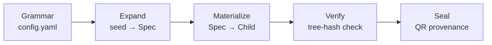
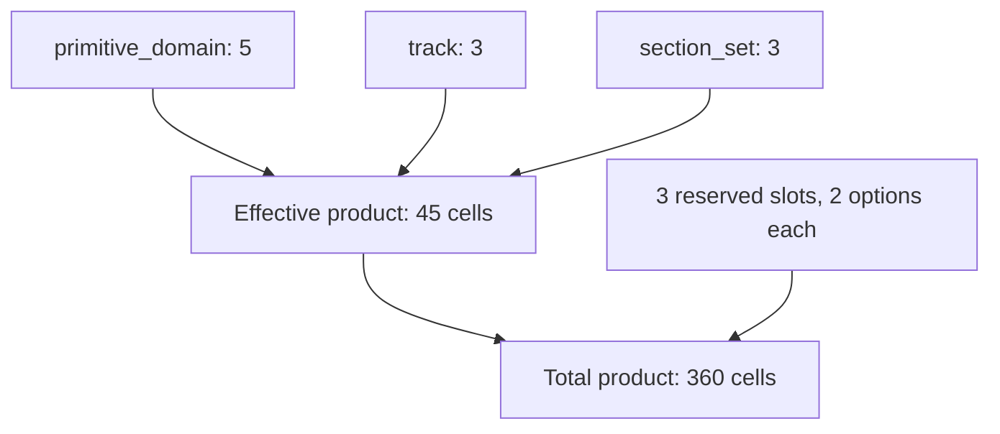

## Abstract

`template_autopoiesis` is a combinatoric grammar that **deterministically generates
whole runnable projects** — not files or snippets, but complete, independently
testable child repositories with their own kernel source, tests, analysis
entry point, and manuscript. A single integer seed plus a grammar of orthogonal
slots (primitive domain, analytical track, section set, and three
presentation/provenance slots) selects one child from a combinatoric product
space of 360 nominal (45 content-distinct)
configurations, via a SHA-256 digest of the seed and slot identity — with no
random-number generator anywhere in the expansion path.

Project generators routinely claim completeness, determinism, and
traceability without making any of the three independently checkable. This
exemplar treats each claim as a structural property to verify rather than a
rhetorical one to assert: `verify_child()` recomputes a tree hash from the
files actually on disk and compares it against the recorded provenance,
rather than trusting a value the same run wrote down; a honesty manifest
inspects the live source AST to confirm every claim in this manuscript
resolves to a real function in a real file; and a per-domain mutation gate
checks that the acceptance tests reject a constant-success stub before
trusting that they accept the real kernel. The same discipline governs this
document itself — every number below is substituted at render time from a
live measurement rather than hand-typed as a literal.

Across 5 heterogeneous primitive domains
(- optimization
- dynamics
- statistics
- signal
- graph), 493 tests exercise both fixed ground-truth
checks and Hypothesis-driven property invariants at 96.28% branch
coverage, with an explicit negative control per domain distinguishing the
real kernel from a deliberately-wrong one.

### Generation pipeline

### Grammar product space

- **Domain count**: 5
- **Effective product size**: 45
- **Total product size**: 360
- **Reserved slots**: 3 (`figure_profile, qr_profile, integrity_profile`)
- **Grammar hash**: `f84a8f9dbcb18e37`
- **Tests**: 493 · **Coverage**: 96.28%
