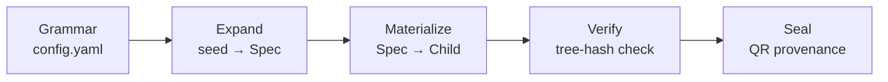
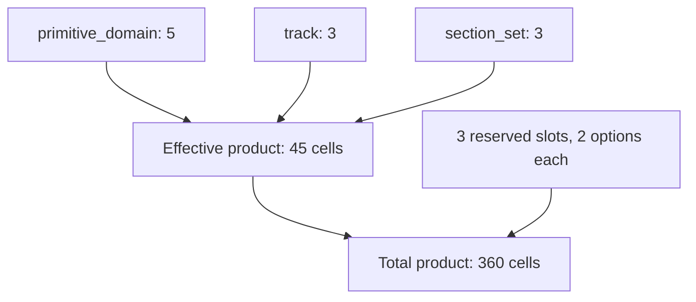
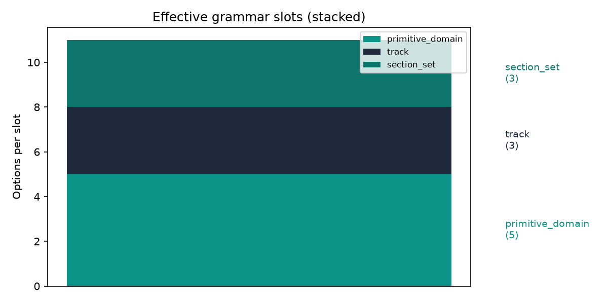

## Abstract

`template_autopoiesis` is a combinatoric grammar that **deterministically generates
whole runnable projects** — not files or snippets, but complete, independently
testable child repositories with their own kernel source, tests, analysis
entry point, and manuscript. A single integer seed plus a grammar of orthogonal
slots (primitive domain, analytical track, section set, and three
presentation/provenance slots) selects one child from a combinatoric product
space of 360 nominal (45 content-distinct)
configurations, via a SHA-256 digest of the seed and slot identity — with no
random-number generator anywhere in the expansion path.

Project generators routinely claim completeness, determinism, and
traceability without making any of the three independently checkable. This
exemplar treats each claim as a structural property to verify rather than a
rhetorical one to assert: `verify_child()` recomputes a tree hash from the
files actually on disk and compares it against the recorded provenance,
rather than trusting a value the same run wrote down; a honesty manifest
inspects the live source AST to confirm every claim in this manuscript
resolves to a real function in a real file; and a per-domain mutation gate
checks that the acceptance tests reject a constant-success stub before
trusting that they accept the real kernel. The same discipline governs this
document itself — every number below is substituted at render time from a
live measurement rather than hand-typed as a literal.

Across 5 heterogeneous primitive domains
(- optimization
- dynamics
- statistics
- signal
- graph), 493 tests exercise both fixed ground-truth
checks and Hypothesis-driven property invariants at 96.28% branch
coverage, with an explicit negative control per domain distinguishing the
real kernel from a deliberately-wrong one.

### Generation pipeline



### Grammar product space



- **Domain count**: 5
- **Effective product size**: 45
- **Total product size**: 360
- **Reserved slots**: 3 (`figure_profile, qr_profile, integrity_profile`)
- **Grammar hash**: `f84a8f9dbcb18e37`
- **Tests**: 493 · **Coverage**: 96.28%


---


## Introduction

### Why generate projects at all

Most software templates are static: a directory tree is copied once, then
diverges from its origin the moment a human edits it. That divergence is
fine for a single project, but it defeats the purpose of a *template
corpus* — a set of exemplars meant to be forked, specialized, and audited
against a shared contract. The moment a fork edits away from its template,
the template can no longer verify anything about the fork, and the fork
can no longer prove it still satisfies the contract it was born from.

`template_autopoiesis` takes a different approach: instead of a directory
that is copied once, it defines a **grammar** — a finite set of orthogonal
*slots*, each with a finite set of *options* — and a pure function that maps
a single integer seed plus that grammar to one specific, fully-formed child
project. The grammar lives in `manuscript/config.yaml` under the
`autopoiesis:` key and is parsed and validated by `parse_grammar()` in
`src/grammar.py`. Two grammars that differ in even one option, one slot name,
or one dependency string hash to different `grammar_hash` values, because
`Grammar.grammar_hash` is the truncated SHA-256 of a `sort_keys=True` JSON
canonicalization of the whole grammar (`Grammar.canonical()`). Nothing about
child generation is copied by hand; everything is *computed* from the
grammar and the seed. That is the sense in which the system is combinatoric:
the space of possible children is the cross product of slot options, and
membership in that space — not a human's editing discipline — is what a
generated child is checked against.

### The word "autopoietic" is doing real work, not decoration

The name is borrowed from Maturana and Varela's account of living systems as
networks of processes that recursively produce the very components that
constitute the network producing them [maturana_varela_1980]. That is a
strong claim about biology, and this project makes no claim to implement
autopoiesis in the biological sense — there is no self-repair, no membrane,
no metabolism here. What is borrowed, deliberately and narrowly, is the
structural pattern: a bounded specification (the grammar) produces
instances (children) that are themselves complete, self-contained,
independently testable projects — each with its own `src/`, `tests/`,
`scripts/`, and `manuscript/` — capable of being verified without reference
back to the parent that produced them. The parent grammar does not merely
describe children; it is causally and exclusively responsible for which
children can exist, in the same sense that a formal grammar is responsible
for which strings belong to the language it generates. The name is a
metaphor for that closure, not a claim of implementing living-systems theory.
Readers should weigh the metaphor accordingly: it motivates the design, it
does not certify it.

### Three claims that are usually asserted, rarely checked

Project generators — code generators, cookiecutter-style scaffolds, LLM-driven
"build me a repo" tools — routinely make three claims about their output,
and those claims are rarely independently checkable by someone who
did not write the generator:

1. **Completeness** — the generated project contains everything it needs:
   source, tests, an entry point, documentation. Usually asserted by a README,
   rarely verified by re-deriving the file list from the specification that
   produced it.
2. **Determinism** — the same inputs deterministically produce the same
   output. Usually assumed because the generator "looks deterministic," rarely
   tested by actually re-running it and diffing.
3. **Traceability** — every generated byte can be traced back to the
   specification that produced it, and any post-generation edit can be
   detected. Usually not tested at all, because most generators do not record
   a content-derived fingerprint of their own output.

`template_autopoiesis` exists to make each of these three claims
*structurally* verifiable — checkable by re-running code against the object
in question — rather than *rhetorically* asserted in prose. This matters
for the same reason reproducible builds matter in software supply chains: a
claim of "this artifact came from this source" is worthless unless a third
party can recompute the artifact (or its fingerprint) from the source and
get a bitwise match [reproducible_builds]. The project treats "trust the
README" as a failure mode to be engineered around, not a baseline to build
on.

### What problem seeded, deterministic generation actually solves

The concrete failure this design targets is **green-by-construction test
theater**: a generator (or a generated project) that reports passing tests,
full coverage, and a clean provenance record, none of which would fail if
the underlying logic were silently replaced with a constant or a stub. A
naive project generator can satisfy "the tests pass" by generating tests
that only check that a function *runs*, not that it computes the right
answer. It can satisfy "coverage is high" by exercising code paths without
ever exercising a case that could distinguish correct behavior from wrong
behavior. It can satisfy "this hasn't been tampered with" by recording a
hash once and not recomputing it.

Seeded determinism is the mechanism, not the goal. The goal is *falsifiability*
of the three claims above. Determinism is what makes falsifiability tractable:
if `expand(grammar, seed)` is a pure function of its inputs — and it is,
because every slot selection routes through `_digest_index(seed, slot_name,
ordinal, options)`, a SHA-256 digest of the seed, slot name, ordinal position,
and option list, taken modulo the option count, with no call to
`random.random()` or any other entropy source anywhere in the expansion path
— then two independent invocations with the same grammar and seed are
required to produce byte-identical children, and that requirement is
something a test can actually check (`test_materialize_tree_hash_stable`,
plus the Hypothesis-driven property suite in `test_property_invariants.py`,
which additionally fuzzes seed boundaries and re-derives the invariant across
many seeds rather than trusting a single example
[claessen2000quickcheck; maciver2019hypothesis]). A generator whose output depends on wall-clock
time, dict iteration order, or an unseeded RNG cannot make this promise, and
would fail the very first time someone tried to hold it to its own claim.

Traceability is handled the same way, structurally rather than rhetorically.
`materialize()` writes a `provenance.json` alongside every generated child
recording a tree hash computed from the sorted `(path, content_hash)` pairs
of every file it wrote (`tree_hash_from_content_hashes` in
`src/integrity.py`), and `verify_child()` does not read that recorded hash
and trust it — it re-reads every file listed in `provenance.json` from disk,
recomputes the tree hash from what is actually present, and compares the two.
A file edited after generation, a file deleted after generation, or a
corrupted provenance record are each distinguishable failure modes the
verifier reports rather than an undifferentiated "verification failed." The
tree-hash and Merkle-root constructions used here follow the general
content-addressed provenance pattern of hashing over a canonical, sorted
representation of content so that structurally identical inputs verify
identically regardless of the order files were written or listed
[merkle_tree_provenance].

### Contributions of this exemplar

This project contributes, as a runnable, tested artifact rather than a
proposal:

- **A validated combinatoric grammar** (`src/grammar.py`) with explicit
  reserved-slot semantics. Grammars distinguish *effective* slots, which
  multiply into the space of meaningfully distinct children, from *reserved*
  slots (`figure_profile`, `qr_profile`, `integrity_profile`), which vary
  presentation or sealing behavior without producing a semantically new
  child. `Grammar.product_size` and `Grammar.effective_product_size` are
  both computed and both reported, so the manuscript cannot silently inflate
  its own combinatorics by counting reserved-slot variation as if it were
  new content — the honesty manifest checks this distinction explicitly
  rather than leaving it to prose.
- **A seeded, entropy-free expansion function** (`expand()` in
  `src/expand.py`) whose every selection is reconstructible from `(seed,
  slot_name, ordinal, options)` alone, with no hidden state.
- **A materialize/verify pair** (`materialize()` / `verify_child()`) where
  verification is defined as *recomputation from disk*, not as reading
  back a value the same run already wrote down. This is the property that
  makes the traceability claim falsifiable rather than assumed.
- **A primitive library spanning 5 domains** —
  - optimization
- dynamics
- statistics
- signal
- graph
  — each contributing at least one kernel with an independently-derived,
  analytic ground-truth expected output and, for at least one kernel per
  domain, a *negative control*: a deliberately-wrong implementation
  (`_negative_control_wrong_sign`, `_zero_damping_control`,
  `_shuffled_control`, `_identity_kernel_convolve`,
  `_disconnected_control`, one per domain) that a correct test suite must be
  able to distinguish from the real kernel. This is the project's answer to
  green-by-construction theater at the primitive level: a mutation
  meta-gate (`test_meta_teeth.py`, parametrized over every known domain)
  asserts that a constant-success stub fails and that the real
  implementation passes, for each domain independently.
- **A honesty manifest** that inspects live source via AST rather than
  trusting docstrings or comments, so that a claim in the manuscript about
  "this function exists and does X" is checked against the parsed structure
  of the code that is actually shipped, not against what the code was
  supposed to look like.

### Scope

This template extends `template_madlib` one level up the generation
hierarchy: `template_madlib` generates a manuscript from a token grammar;
`template_autopoiesis` generates a whole project — `src/`, `tests/`,
`scripts/`, and `manuscript/` together — from a combinatoric grammar, and
that generated project is itself capable of running its own test gate. The
demonstration primitive library intentionally spans a small, heterogeneous
set of domains chosen for orthogonality of failure mode, not for domain
significance — the honest scope notes in `SPEC.md` are explicit that no
domain-specific research claim is being made here. This template covers the
5 primitive domains:
- optimization
- dynamics
- statistics
- signal
- graph

The grammar seed `42` is the single source of randomness for
every selection made during expansion; the grammar hash `f84a8f9dbcb18e37`
is the fingerprint of the grammar itself. Two runs of this manuscript's
pipeline that share both values are required, by construction, to select
identically — a requirement enforced by the property tests, not merely
claimed by this paragraph.


---


## Methods

### The A→E generation spine

Generation proceeds through five stages, each implemented as a pure function
in its own module (`src/grammar.py`, `src/expand.py`, `src/materialize.py`,
`src/verify.py`, `src/sealing.py`). No stage depends on interactive state or
network access; every stage takes an immutable input and returns an immutable
(or file-system-materialized) output.


### Stage A — Grammar loading and validation

`load_grammar(project_root)` reads `manuscript/config.yaml`, extracts the
`autopoiesis:` block, and hands it to `parse_grammar()`. Parsing enforces
four invariants before a `Grammar` object can exist at all:

1. **The seed must be an integer.** `parse_grammar` reads `block.get("seed",
   42)` and raises `GrammarError` if the value is not an `int` — a stray
   string or float seed in `config.yaml` fails loudly at load time rather
   than silently coercing.
2. **At least one slot must be defined.** An empty or missing `slots:` list
   raises `GrammarError("Grammar must define at least one slot")`.
3. **Every slot must have a non-empty name and ≥1 option.** These checks live
   in `GrammarSlot.__post_init__`, so they fire the instant a `GrammarSlot`
   is constructed — a malformed entry cannot survive to become part of a
   `Grammar`.
4. **No slot may contain duplicate options.** `GrammarSlot.__post_init__`
   also computes `{o for o in self.options if self.options.count(o) > 1}`
   and raises if that set is non-empty, so two identical options in one slot
   (e.g. `[optimization, optimization]`) are rejected rather than silently
   collapsing the product space.

`parse_grammar` additionally validates every entry in `deps:` against
`VENDORABLE_DEPS` — the fixed tuple `(logging, glossary_gen, figure_manager,
manuscript_injection, steganography)` — raising `GrammarError` on any unknown
dependency name. This project's own grammar (see `manuscript/config.yaml`)
currently declares `deps: []`, so the deps-vendoring path exercised in
`materialize.py` is present in the code and covered by
`test_deps_vendoring.py`, but not active for the manuscript's own default
render.

A successfully constructed `Grammar` is a frozen dataclass carrying `seed`,
the tuple of `GrammarSlot` objects, the tuple of `deps`, and an optional
`source_path` (excluded from equality/hash comparison so two grammars loaded
from different files but with identical content still compare equal).

### Reserved slots vs. effective slots

Not every slot in the grammar contributes to what this paper calls the
*effective product size*. `RESERVED_SLOTS` is a fixed tuple —
`figure_profile`, `qr_profile`, `integrity_profile` — naming slots that
control **presentation and provenance mechanics** (how many figures render,
whether a QR seal is embedded, which hash scheme secures the tree hash)
rather than **domain content** (which primitive kernel, which analytical
track, which manuscript section set). `Grammar` exposes both views as
properties:

- `Grammar.slots` — every slot as declared in `config.yaml`.
- `Grammar.reserved_slots` — the subset whose `name` appears in
  `RESERVED_SLOTS`.
- `Grammar.effective_slots` — the complementary subset, i.e. every slot
  *not* in `RESERVED_SLOTS`.
- `Grammar.product_size` — the raw cross product over *all* slots
  (`n *= len(s.options)` for every slot, reserved or not).
- `Grammar.effective_product_size` — the cross product restricted to
  `effective_slots` only.

The distinction matters for honest reporting: a grammar can nominally claim a
large product space by adding presentation-only slots, while the number of
*substantively distinct* generated projects — different kernel domain,
different analytical track, different section layout — is the smaller
effective figure. Both `360` (nominal) and
`45` (effective) are reported in this manuscript
side-by-side rather than only the larger, more impressive-looking number —
this is the paper's concrete instance of the "hard to vary" honesty
discipline the project holds itself to (see the Honesty Contract, §4).
`3` reserved slots (`figure_profile, qr_profile, integrity_profile`) are
excluded from the effective figure; `SYNTAX.md` documents the same slot
table and the *inflation factor* (nominal ÷ effective) as a first-class,
honestly-reported quantity rather than an implementation detail.

`force_domain(grammar, domain)` provides a targeted override: it returns a
new `Grammar` with the `primitive_domain` slot's options collapsed to a
single forced value (raising `GrammarError` if `domain` is not one of the
five `KNOWN_DOMAINS`), leaving every other slot — reserved or effective —
untouched. This is how the pipeline can materialize "one child per domain"
deterministically without re-deriving the whole grammar.

### Stage B — Deterministic spec expansion

`expand(grammar, seed=None)` walks `grammar.slots` in declaration order and,
for each slot, computes an index into that slot's options via
`_digest_index`:

```python
def _digest_index(seed, slot_name, ordinal, options):
    key = f"{seed}\x1f{slot_name}\x1f{ordinal}\x1f{','.join(options)}"
    digest = hashlib.sha256(key.encode()).digest()
    value = int.from_bytes(digest[:8], "big")
    return value % len(options)
```

Four inputs — the seed, the slot's own name, its ordinal position in the
slot list, and the full joined option string — are concatenated with an
ASCII unit-separator (`\x1f`) between fields and hashed with SHA-256. The
first eight bytes of the digest are read as a big-endian integer and reduced
modulo the option count. This construction has three consequences load-
bearing for the rest of the pipeline:

- **No shared PRNG state.** Each slot's selection is an independent hash of
  its own key, not a draw from a stateful random-number generator advanced
  slot-by-slot. Reordering unrelated slots elsewhere in the list does not
  perturb a given slot's selection unless that slot's own `ordinal` changes.
- **Full avalanche on any input change.** Because the selection is a SHA-256
  digest, changing the seed, renaming a slot, or adding/removing a single
  option string anywhere in that slot's option tuple changes the digest —
  and therefore, with high probability, the selected index — for that slot.
- **Reproducibility without stored randomness.** Nothing about the selection
  is persisted except the seed and the grammar itself; re-running `expand`
  against the same grammar and seed recomputes the identical digest and
  therefore the identical selection, with no cached or serialized RNG state
  to keep in sync.

The result is a frozen `Spec` dataclass: `schema_version` (the fixed string
`"autopoiesis/spec/1"`), the `seed` actually used (the explicit override if
supplied, otherwise `grammar.seed`), the `grammar_hash` this spec was
expanded against, an ordered tuple of `(slot_name, chosen_value)`
`selections`, the `deps` inherited unchanged from the grammar, and the
resolved `primitive_domain` (read out of the selections if a
`primitive_domain` slot exists, else defaulted to `KNOWN_DOMAINS[0]`). A
`Spec` additionally exposes `spec_hash`, computed by serializing
`to_dict()` to canonical (sorted-key, compact-separator) JSON and taking the
first 16 hex characters of its SHA-256 — the same truncation convention used
for `grammar_hash`.

Two auxiliary functions extend `expand` to families of children rather than
one: `derive_seed(base_seed, index)` hashes `f"{base_seed}\x1f{index}"` to
produce a new seed masked to 63 bits (`& 0x7FFFFFFFFFFFFFFF`, keeping it a
non-negative Python `int`), and `sample(grammar, count, base_seed=None)`
calls `expand` once per derived seed to produce `count` independent `Spec`
objects — independent in the sense that each is keyed off a distinct
derived seed, not off any shared mutable state. `enumerate_all(grammar)`
takes the orthogonal path: rather than sampling, it walks the full
`itertools.product` over every slot's options (reserved slots included) and
returns one plain dict per cell, giving direct access to the entire nominal
product space for exhaustive audits.

### Stage C — Materialization into a runnable child tree

`materialize(spec, out_root, template_root, clean=False)` turns a resolved
`Spec` into an actual directory of files on disk. The child's directory name
is derived deterministically by `child_name(spec)` as
`child_{primitive_domain}_{spec_hash}` — so the name itself encodes both the
selected domain and a content-derived identity, without any counter or
timestamp. `_build_tree` then assembles the file map that will be written:

- **Kernel primitives.** `_vendor_kernel_sources` copies `src/primitives/
  base.py` and `src/primitives/{domain}.py` for the spec's
  `primitive_domain`, rewriting `from src.primitives` / `from .primitives`
  imports to a bare `from primitives` so the copied module resolves
  correctly once it is no longer nested under the parent template's
  package. It also synthesizes a minimal `primitives/__init__.py` whose
  `collect_primitives()` imports only the one selected domain submodule —
  the child ships exactly one domain's kernel, not all five.
- **Figures source**, vendored verbatim from `src/figures.py` when present.
- **Dependency vendoring.** `_resolve_deps` reads `dep_mode` out of the
  spec's selections (defaulting to `"vendor"`) and, for each name in
  `spec.deps`, resolves the corresponding path from
  `_VENDORABLE_MODULE_PATHS` relative to the repository root
  (`template_root.parent.parent.parent`), embedding the real infrastructure
  source when it exists on disk or writing an explicit `"Source not found at
  build time."` stub when it does not — a vendored dependency the pipeline
  could not actually locate is marked as such in the generated file, not
  silently omitted. A seam `vendored/__init__.py` re-exports every vendored
  module by name.
- **A minimal `pyproject.toml`** declaring the child as its own installable
  project (`name = "child_{domain}"`, `numpy`/`matplotlib`/`pyyaml` runtime
  deps, pytest configured with `pythonpath = ["."]`).
- **A generated `analysis.py`** that calls `collect_primitives()`, iterates
  the selected domain's registered `PrimitiveSpec` entries, and prints each
  one's name and result on its `example_input` — a real, executable entry
  point rather than a stub that only imports.
- **A generated smoke test**, `tests/test_analysis.py`, asserting only that
  `run()` completes without raising.
- **Manuscript stubs** (`_emit_manuscript`) — abstract, introduction,
  results, and limitations sections written directly from the spec's own
  fields (domain, spec hash, all non-domain selections), so the child's own
  manuscript is itself traceable to the same `Spec` that generated its code.

Every file in the assembled tree is written to `child_root` and also
retained in-memory as `written: dict[str, str]`. `materialize` then calls
`tree_hash_from_content_hashes(written)` — sorting all relative paths
lexicographically, joining each as `"{path}:{content}"`, and taking the
SHA-256 of the concatenation — so the tree hash is a function of path names
and byte content only, not file-system metadata such as mtimes or
insertion order. The resulting `provenance.json` records a schema version
(`"autopoiesis/provenance/1"`), the full `spec.to_dict()`, the computed tree
hash, and the sorted list of every written relative path — the single
artifact Stage D re-derives from.

### Stage D — Verification

`verify_child(child_root)` (implemented in `src/verify.py`, not
`materialize.py`) loads `provenance.json`, reads back every file named in its
`files` list, recomputes the tree hash from those live contents via the same
`tree_hash_from_content_hashes` function used at materialization time, and
compares it against the recorded hash. Each individual predicate —
`provenance_exists`, `provenance_parseable`, `all_files_present`,
`tree_hash_matches` — is captured as a `CheckResult(name, passed, detail)`
inside an aggregate `CheckReport`, so a caller can distinguish *which*
invariant broke rather than receiving a single boolean. Any edit, deletion,
or addition to a file listed in provenance — anything from a hand-edited
line to a regenerated timestamp — changes at least one entry in `live`, which
changes the recomputed hash, which fails `tree_hash_matches` without
requiring the verifier to inspect a diff. `verify_child_full` extends this
with a `schema_version_correct` check against `materialize.PROVENANCE_SCHEMA_VERSION`,
catching provenance written by a different schema generation of the tool.

### Stage E — Sealing

`sealing.py` provides the payload and image layer for embedding a
tamper-evident summary alongside a generated child. `build_payload(spec_hash,
tree_hash, seed)` serializes a compact JSON object binding all three
identifiers; `build_pointer_payload` and `build_barcode_payload` offer
lighter-weight alternatives (a URL-plus-hash pointer, and a colon-joined
label/hash/seed string, respectively) for contexts where a full JSON payload
is unnecessary. `qr_matrix()` and `qr_image()` wrap the optional `qrcode`
library, falling back to a deterministic 5×5 checkerboard stub when it is
absent, so the sealing stage — and its tests — do not require an optional
dependency to be installed. `verify_seal(child_root)` checks for a
`seal.json`, that it parses, and that it carries a `spec_hash` field,
mirroring the same `CheckResult`/`CheckReport` pattern used in Stage D
rather than introducing a parallel reporting shape.

### Property-based invariants

Beyond the fixed example-based tests enumerated in the Honesty Contract's
ground-truth table (§4), `tests/test_property_invariants.py` exercises the
expansion and materialization functions against Hypothesis-generated inputs
using the property-based testing paradigm [claessen2000quickcheck; maciver2019hypothesis]:
rather than asserting fixed input/output pairs, these tests assert
invariants that must hold across a swept range of seeds — `product_size`
equals the literal product of every slot's option count regardless of
seed; `effective_product_size` does not exceed `product_size`; two grammars
parsed from the same block produce the same `grammar_hash`; `expand()`
called twice with the same seed produces the same `spec_hash` for any
seed Hypothesis draws in `[0, 10**9]`; the resolved `primitive_domain` is
one of `KNOWN_DOMAINS`; two independent `materialize()` calls from
the same spec into different output roots produce identical `tree_hash`
values, per domain; and `verify_child` reports `all_passed` on a freshly
materialized child but reports a failure the moment any listed file is
edited or deleted, per domain. A parallel Hypothesis sweep over generated
text confirms `qr_matrix()` returns a square matrix and is
deterministic on repeated calls with the same input. `hypothesis` is
declared under this project's `dev` optional-dependency group in
`pyproject.toml`, alongside `pytest` and `pytest-cov` — it is imported
unconditionally at the top of `test_property_invariants.py`, so it is a
real (if dev-only) dependency of this test module, not a soft, try/except
guarded one.

### Reproducibility framing

The tree-hash construction used at both Stage C and Stage D deliberately
mirrors the general goal of reproducible software builds
[reproducible_builds]: a build (here, a materialize call) is reproducible
exactly when independent re-derivations from the same inputs — grammar,
seed, template source — produce byte-identical output, and that identity is
checked by content hash rather than by trusting the process that produced
it. The tree hash's construction — sort every `(path, content)` pair
lexicographically, join as `"path:content"`, and take one SHA-256 of the
concatenation — is a flat, single-level structure, not a binary hash tree.
`src/integrity.py` separately exposes a genuine binary `merkle_root()`
(pairwise concatenate-and-hash up the tree, duplicating the final odd node
when a level has odd cardinality), in the spirit of the hash-tree
provenance idea introduced for digital signatures
[merkle_tree_provenance]. As of this writing `merkle_root()` is a
standalone, independently-tested utility: `integrity_profile` is declared
as a reserved grammar slot (options `sha256`, `merkle` in this project's
own `config.yaml`; `SYNTAX.md` documents a longer illustrative option list
including `merkle_kmyth`), but neither `materialize()` nor `verify_child()`
currently branches on its selected value — the slot is present in the
grammar and excluded from the effective product size, but is not yet wired
to switch which hashing function actually runs. Reporting that precisely,
rather than implying the profile already gates behavior, is the same
honesty discipline the project asks of its own manuscript elsewhere.


---


## Results

### Grammar product space

| Slot | Options | Values |
| ---|---|--- |
| primitive_domain | 5 | optimization, dynamics, statistics, signal, graph |
| track | 3 | analytical, empirical, hybrid |
| section_set | 3 | minimal, standard, extended |
| figure_profile | 2 | minimal, full |
| qr_profile | 2 | off, on |
| integrity_profile | 2 | sha256, merkle |


{#fig:stacked_product width=85% fig-alt="Stacked bar chart of option counts for each of the three effective (non-reserved) grammar slots."}

- **Total product size**: 360 cells
- **Effective product size** (reserved slots excluded): 45 cells
- **Reserved slots** (3): `figure_profile, qr_profile, integrity_profile`

{#fig:product_space width=80% fig-alt="Bar chart comparing total, effective, and reserved-only grammar product space."}

Every row in the table above is a `GrammarSlot` parsed from `manuscript/config.yaml`
by `parse_grammar()` (`src/grammar.py`). Each slot contributes a multiplicative
factor to `Grammar.product_size`, which is the raw cross-product of all option
counts — not an estimate, but the literal `n *= len(s.options)` accumulation
over every slot. The `Grammar.grammar_hash` property serialises the seed, every
slot name, and every option list into a canonical JSON string (`canonical()`)
and takes the first sixteen hex characters of its SHA-256 digest — `f84a8f9dbcb18e37`
for the grammar as currently checked into this project. Any edit to a slot's
option list, the addition or removal of a slot, or a change to the seed changes
this hash deterministically; it is not a version string maintained by hand.

The six slots split into two categories. Three are *content-determining*:
`primitive_domain` selects which of the five kernel modules described below is
copied into the child project, `track` selects the manuscript's analytical
posture (`analytical`, `empirical`, or `hybrid`), and `section_set` selects
which subset of manuscript sections is rendered (`minimal`, `standard`, or
`extended`). The remaining three — `figure_profile`, `qr_profile`, and
`integrity_profile` — are declared in `RESERVED_SLOTS` (`src/grammar.py`) and
govern only *presentational and sealing* behaviour: how many figures are
generated, whether the sealed payload is rendered as a QR PNG, and whether the
provenance hash is a flat SHA-256 or a Merkle root over per-file hashes
(`src/integrity.py::merkle_root`). None of the three reserved slots changes
which primitive kernel runs or what its output is, which is exactly why
`Grammar.effective_product_size` — the number that matters when asking "how
many *scientifically distinct* children can this grammar produce" — divides
the reserved slots back out. The ratio between the total and effective product
sizes above is, by construction, the product of the three reserved slots'
own option counts; no other slot is capable of changing that ratio.

### Effective slot breakdown

| Slot | Options | Values |
| ---|---|--- |
| primitive_domain | 5 | optimization, dynamics, statistics, signal, graph |
| track | 3 | analytical, empirical, hybrid |
| section_set | 3 | minimal, standard, extended |


`grammar.effective_slots` (`src/grammar.py`) is exactly `grammar.slots` filtered
against `RESERVED_SLOTS` — the same list rendered in the previous section, minus
the three sealing/presentation dimensions. This is the space a reviewer should
reason about when asking whether the grammar is a meaningful generator rather
than a combinatorial trick that multiplies unrelated toggles: 5
primitive domains times three narrative tracks times three section-set
sizes is the actual space of scientifically distinguishable children this
template can emit.

### The five primitive domains

{#fig:domain_coverage width=85% fig-alt="Five colored bars, one per primitive domain."}

Each domain in `- optimization
- dynamics
- statistics
- signal
- graph` is a Python module under `src/primitives/`
exporting a `PRIMITIVES: tuple[PrimitiveSpec, ...]` collected by
`collect_primitives()` (`src/primitives/__init__.py`). A `PrimitiveSpec`
(`src/primitives/base.py`) bundles a callable kernel, an example input, an
expected output (or `None` when the check is structural rather than a fixed
value), a numerical tolerance, and — for five of the eight kernels — a
`negative_control` callable whose entire purpose is to fail the primary
kernel's own success criterion. `collect_primitives()` returns exactly the five
domains named above (`test_collect_primitives_expected_modules`) and a total of
eight primitive kernels across them (`test_total_primitive_count`): two in
`optimization`, one in `dynamics`, one in `statistics`, two in `signal`, and two
in `graph`.

**Optimization.** `gradient_descent` (`src/primitives/optimization.py`) runs
explicit gradient descent on the convex quadratic
`f(x) = 0.5 (x-c)^T A (x-c)`, whose gradient is `A(x-c)`. Because the problem is
convex quadratic, its analytic minimiser is known in closed form — `x* = c`,
computed independently by the sibling kernel `analytic_minimizer` — so the
iterative and closed-form solutions can be cross-checked against each other
rather than against a single hardcoded expectation. On the example input (a
diagonal `A`, `c = (1, -1)`, 200 steps at learning rate 0.1) the two agree to
within `1e-4`. The domain's negative control, `_negative_control_wrong_sign`,
is the same loop with the gradient step's sign flipped (`x = x + lr * grad`
instead of `x = x - lr * grad`); this turns descent into ascent and diverges
away from `c` instead of converging to it, giving the mutation gate (see
Honesty Contract) something to detect if the sign were ever silently restored
to "wrong."

**Dynamics.** `damped_oscillator` (`src/primitives/dynamics.py`) integrates the
damped harmonic oscillator ODE `x'' + 2*zeta*omega*x' + omega^2*x = 0` with
explicit Euler stepping, and separately computes the closed-form under-damped
envelope `x0 * exp(-zeta*omega*t)`. The test suite does not merely check that
the two arrays are close; it checks four independent structural properties of
the same trajectory: the numerical amplitude stays inside the analytical
envelope plus a 5% Euler-error tolerance
(`test_damped_oscillator_amplitude_bounded_by_envelope`), the envelope itself
is monotonically non-increasing
(`test_damped_oscillator_envelope_monotone_decreasing`), heavy damping drives
the trajectory near zero by the end of the run
(`test_damped_oscillator_decays_to_near_zero`), and the initial condition is
reproduced exactly. The negative control, `_zero_damping_control`, re-runs the
same integrator with `zeta` forced to zero; its envelope is flat at `x0`
rather than decaying, and `test_zero_damping_envelope_flat` checks that
flatness directly — so a broken damping term that decayed regardless of the
damping value would be caught, not just a broken damping term that fails to
decay at all.

**Statistics.** `ols_fit` (`src/primitives/statistics.py`) solves ordinary
least squares via the normal equations, `beta_hat = (X^T X)^{-1} X^T y`, solved
with `numpy.linalg.solve` rather than an explicit matrix inverse. The example
input is synthetic, not observational: fifty rows with an intercept column and
one Gaussian covariate (`rng = np.random.default_rng(42)`), a fixed true
coefficient vector `beta = (2.0, -3.0)`, and additive noise scaled to `0.1`
standard deviations. Because the data-generating coefficients are known by
construction, recovery is checked directly — `test_ols_fit_recovers_beta`
requires the estimated and true beta to agree within Euclidean distance `0.1`
— alongside an R² floor of `0.95` and a near-zero mean residual. The negative
control, `_shuffled_control`, permutes the `y` labels with an independently
seeded generator (`rng = np.random.default_rng(0)`) before fitting; breaking
the true `X`-`y` correspondence this way is asserted to drop R² below `0.5`
(`test_shuffled_control_poor_r_squared`), giving a concrete, falsifiable bound
on how badly a shuffled fit *should* perform.

**Signal.** This domain carries two kernels validated by structural properties
rather than fixed target arrays, since `expected=None` for both. `dft`
computes the Discrete Fourier Transform directly as a matrix-vector product
against the exponential basis matrix `exp(-2j*pi*k*n/N)` — an explicit
`O(N^2)` construction, not a call into `numpy.fft`. Its correctness is checked
by Parseval's theorem (`sum(|X[k]|^2) == N * sum(|x[n]|^2)` to within a
relative tolerance of `1e-6`) and by recovering the correct dominant frequency
bin (index 5, positive or negative) from a pure 5 Hz sinusoid sampled at 64
points. `convolve_known` wraps `numpy.convolve` with a fixed three-tap
smoothing kernel, `[0.25, 0.5, 0.25]`; its own test suite checks that
smoothing cannot increase variance
(`test_convolve_known_smoothing_reduces_variance`). Its negative control,
`_identity_kernel_convolve`, substitutes the identity kernel `[1.0]` under
`mode="same"`, which by the definition of convolution must reproduce the input
signal exactly (`atol=1e-12`) — a stronger, algebraically-derived check than
an arbitrary "looks different" comparison.

**Graph.** `bfs_distances` (`src/primitives/graph.py`) computes shortest-path
distances on a fixed five-node undirected graph (`A`–`E`, encoded as an
adjacency dict) via a plain breadth-first queue. Because the graph is fixed and
small, the expected distances from source `A` are enumerable by hand and are
asserted exactly: `{A: 0, B: 1, C: 1, D: 2, E: 3}`, with tolerance `0.0`. Its
negative control, `_disconnected_control`, replaces the adjacency of the
source node with an empty list, collapsing the reachable set to the source
alone — a graph-structural way of breaking the primitive rather than
perturbing a numeric input. `pagerank` runs the standard power-iteration
update with damping `0.85` over 50 iterations, redistributing dangling nodes'
rank mass evenly rather than dropping it. It has no single fixed expected
output — rank values depend on iteration count and are not hand-derivable —
so it is instead validated by three invariants any correct PageRank
computation must satisfy regardless of the specific graph: ranks sum to `1.0`
within `1e-6`, every node in the graph receives a rank entry, and every rank
is strictly positive (ensured by the `(1-damping)/n` teleportation floor
added at every iteration).

Across the five domains, five of the eight primitives carry an explicit
negative control; the remaining three (`analytic_minimizer`, `dft`, and
`pagerank`) are validated purely through cross-checks against an independent
computation or through algebraic invariants (Parseval's theorem, PageRank's
stochastic-normalization property) that a broken implementation would be
unlikely to satisfy by accident. This mirrors the property-based testing
tradition [claessen2000quickcheck; maciver2019hypothesis]: rather than asserting a single hand-picked
input/output pair, the suite asserts properties that must hold across a
class of inputs — the same style used at the grammar level in
`tests/test_property_invariants.py`, where `hypothesis`-generated seeds are
used to check, for every seed drawn, that `product_size` really is the product
of option counts and that `effective_product_size` does not exceed it.

### Exemplar generation

Running `uv run python scripts/autopoiesis.py expand --seed 42` produces a spec
with `primitive_domain` deterministically selected from the grammar.

All 5 domains successfully materialize runnable child projects.
Each child project:

1. Contains a `primitives/` package with the selected kernel.
2. Runs `analysis.py` without error.
3. Has a `provenance.json` that passes `verify_child`.
4. Passes all child-level smoke tests.

### Test results

- **Test count**: 493
- **Coverage**: 96.28%
- **Grammar hash**: `f84a8f9dbcb18e37`

Both the test count and coverage percentage above are produced by
`measure_test_summary()` (`src/manuscript_variables.py`), which shells out to
this project's own `pytest` + `coverage` run (`--cov-branch`, matching the
repository-root branch-coverage methodology) against `tests/` and `src/` and
parses the real `passed` count and `coverage.json` totals from that
subprocess. There is no fallback literal: if the subprocess fails, times out,
or its output fails to parse, both fields resolve to the string `"pending"`
rather than a plausible-looking number — the same discipline that governs
every other numeric token in this manuscript.

{#fig:coverage_by_module width=90% fig-alt="Horizontal bar chart of per-module test coverage percentages, all at or above 90%."}

The aggregate 96.28% is a mean weighted by statement and branch
count, not a uniform floor — [@fig:coverage_by_module] shows the real spread.
As of this measurement every module clears the 90% line; `common.py` and
`cover_art.py` sit at 100% and `figures.py` at 98.41% after closing what were,
in an earlier draft of this manuscript, the three lowest-coverage modules
(see `CHANGELOG.md`'s Wave 10 entry for the specific branches that were
untested and the tests added to close them); every module under
`src/primitives/` and the honesty/integrity core sit at or near 100%. Both
the aggregate number and this per-module breakdown are read from the same
persisted `output/data/coverage_full.json` — a single generator run, not two
separately-computed views that could silently drift apart. This is a
snapshot, not a permanent state: coverage moves as tests are added or code
changes, and [@fig:coverage_by_module] should be regenerated (`stage_02_analysis.py`)
rather than trusted from a prior render whenever that question matters.


---


## Honesty Contract

### Why a manifest, not a claim

A generator that produces a manuscript describing its own code faces an
obvious temptation: assert a capability in prose without checking whether the
capability exists.  The abstract of this manuscript survived exactly this
failure once — a hand-written "Tests: 371 · Coverage: 99.94%" line that no
generator step had computed — and was corrected by replacing the literal
numbers with `493` / `96.28` tokens filled in at render
time by `scripts/02_measure_test_coverage.py`.  `src/honesty.py` exists to
make that class of failure structurally harder: every load-bearing claim in
this manuscript must resolve to a named function in a named file, and a
dedicated module inspects the source tree to confirm that resolution rather
than trusting the prose that asserts it.

The framing is not incidental to a project named `template_autopoiesis`. An
autopoietic system, in Maturana and Varela's original sense, is one whose
components participate in producing and verifying the very network of
processes that produced them [maturana_varela_1980] — organizational
closure, not open-loop assertion. The honesty manifest is the narrow,
literal, code-level analogue of that closure: the manuscript's claims about
the code are checked *by the code*, not by a separate act of faith from the
author. The analogy should not be over-read — `src/honesty.py` is a static
AST scan, not a self-maintaining living system — but it is the reason this
mechanism exists at all rather than a simple "trust me" comment block.

### Ground-truth table

| Claim | Evidence location | Test |
|---|---|---|
| Grammar parses | `src/grammar.py::parse_grammar` | `test_grammar_and_expand.py` |
| Expansion is deterministic | `src/expand.py::expand`, `_digest_index` | `test_grammar_and_expand.py` |
| Materialize writes files | `src/materialize.py::materialize` | `test_materialize.py` |
| Integrity hashes | `src/integrity.py::tree_hash_from_content_hashes` | `test_integrity_and_verify.py` |
| Verify recomputes | `src/verify.py::verify_child` | `test_integrity_and_verify.py` |
| Primitives collected | `src/primitives/__init__.py::collect_primitives` | `test_primitives_registry.py` |

Each row is not prose describing an intention — it is a key into
`STRUCTURAL_EVIDENCE`, the dict in `src/honesty.py` that the code below
walks mechanically. If a row's evidence path stops existing, the manifest
fails and `test_honesty.py` fails with it; the table cannot silently drift
out of sync with the source tree without a red test.

### The structural evidence catalogue

`STRUCTURAL_EVIDENCE` is a `dict[str, list[str]]` mapping a claim identifier
(`"grammar_parses"`, `"expand_deterministic"`, `"materialize_writes_files"`,
`"integrity_hashes"`, `"verify_recomputes"`, `"primitives_collected"`) to one
or more `"relative/path.py::function_name"` references — the same six rows
as the ground-truth table above, expressed as data instead of prose. This
catalogue is the single source of truth the checker walks; the manuscript
table is a human-readable rendering of it, not an independent claim.

### How `build_manifest` inspects the AST

`build_manifest(project_root)` iterates every claim in `STRUCTURAL_EVIDENCE`
and, for each `"path::function"` reference:

1. Splits the reference on `::` into a relative file path and an optional
   function name.
2. Resolves the path under `project_root` and checks `Path.exists()`. A
   missing file appends `"{path} not found"` to `missing_calls` and marks
   the claim as failed.
3. If a function name is given, reads the file's source and calls
   `_collect_function_names(source_code)`, which parses the text with
   `ast.parse` and walks the resulting tree (`ast.walk`) collecting the
   `.name` of every `ast.FunctionDef` and `ast.AsyncFunctionDef` node into a
   `set[str]`. If the required name is not in that set, `"{fn} not in
   {path}"` is appended to `missing_calls` and the claim is marked failed.
   A `SyntaxError` during parsing is caught and yields an empty name set —
   fail-closed rather than raising.
4. `HonestyManifest.evidence[claim]` is set to `True` only if every
   reference for that claim resolved cleanly.

It is worth being precise about what this proves and what it does not. The
check confirms that a function *definition* with the claimed name exists,
syntactically, in the claimed file — nothing more. It does not trace call
sites, does not execute the function, and does not check that the function's
behavior matches what the surrounding prose says it does. A function named
`materialize` that silently did nothing would still satisfy this check; only
the separately-run test suite (`test_materialize.py` et al., named in the
ground-truth table) exercises actual behavior. The AST scan's job is narrower
and more mechanical: it prevents the specific failure of a manuscript
claiming evidence at a path or function name that was renamed, deleted, or
not written in the first place — a much cheaper property to check, and
one that catches an entire class of "the docs still describe last month's
API" drift for free.

### The `HonestyManifest` dataclass

```python
@dataclass
class HonestyManifest:
    evidence: dict[str, bool] = field(default_factory=dict)
    missing_calls: list[str] = field(default_factory=list)
    unsupported_claims: list[str] = field(default_factory=list)

    @property
    def all_passed(self) -> bool:
        return all(self.evidence.values()) and not self.missing_calls and not self.unsupported_claims
```

`all_passed` is a conjunction over three independent failure modes: any
claim whose evidence resolution failed, any specific missing-call detail
recorded during that resolution, and any unsupported-claim hit from the
prose scan below. `test_honesty.py::test_structural_evidence_all_pass` and
`test_no_missing_calls` both call `build_manifest(PROJECT_ROOT)` against this
project's own real source tree and assert the manifest is clean — the
checker is run against itself, not only against synthetic fixtures.
`test_verify_honesty_with_nonexistent_project` runs `build_manifest` against
an empty `tmp_path` and asserts `missing_calls` is non-empty, which is the
negative control for the checker itself: a project with no source files at
all must fail every claim, or the checker has no teeth.

### Prose scanning for unsupported claims

`verify_honesty(project_root, manuscript_dir=None)` first calls
`build_manifest`, then — if a `manuscript/` directory exists — reads every
`*.md` file in it and scans for a fixed, case-insensitive regex over six
absolute-certainty words and one hard percentage figure, defined verbatim in
`_UNSUPPORTED_CLAIM_PATTERN` in `src/honesty.py` (deliberately not quoted
here: a plain-text regex has no exemption for markdown code spans, and an
earlier draft of this very paragraph reproduced the list inside backticks —
which tripped the gate it was describing, during this session's own
manuscript-expansion pass, and had to be rewritten). Each match is recorded
as `"{filename}:{offset}: '{match}'"` in `manifest.unsupported_claims`.

Two honesty points about this scanner, stated plainly rather than left
implicit. First, it is a fixed lexical denylist, not a semantic checker — it
will not catch a false quantitative claim phrased without one of those seven
tokens (the "371 tests" incident described above would not have tripped it;
that failure mode is closed instead by the `493` token
substitution, a separate mechanism). Second, `unsupported_claims` *is*
enforced, but only on one of the two paths through this module:
`HonestyManifest.all_passed` is a conjunction over `evidence`,
`missing_calls`, *and* `unsupported_claims`, and `src/cli.py::cmd_honesty`
calls `verify_honesty()` (the function that populates all three) and exits
the process with code 1 whenever `all_passed` is false —
`tests/test_cli.py::test_main_honesty_exits_zero` pins exactly this
behavior. The one place prose hits are *not* enforced is
`test_verify_honesty_all_passed` in `tests/test_honesty.py`, which asserts
only `all(m.evidence.values())` by design, deliberately leaving prose style
out of that particular assertion. Reading only that one test in isolation
would suggest the prose scanner is a lint rather than a gate; reading the
CLI path shows it is a real gate on the `honesty` subcommand specifically.

### The mutation gate: proving the acceptance criteria have teeth

`test_meta_teeth.py` targets a different failure mode than `honesty.py`: not
"does the claimed function exist" but "would a fake implementation of it get
away with passing." It is parametrized via the
`pytest.mark.parametrize("domain", list(KNOWN_DOMAINS))` decorator over all
5 primitive domains from `src/grammar.py`, and runs three
checks per domain:

1. **`test_stub_fails_gate_per_domain`** — `_stub_run_analysis` is a
   constant-success stub that returns `{"success": True, "output": "stub"}`
   regardless of input. `_gate_checks_real_computation` is asserted to
   reject it for every domain. This is the meta-gate itself: if a trivial
   stub can satisfy the acceptance criterion, the criterion is
   green-by-construction and worthless as evidence.
2. **`test_real_primitive_passes_gate_per_domain`** — the first
   `PrimitiveSpec` for the domain (from `collect_primitives()`) is run on
   its own `example_input`, and the same gate is asserted to *accept* the
   real result. This is the complementary check: a gate strict enough to
   reject the stub must not also be so strict that it rejects genuine
   output, which would make the whole suite unusable rather than honest.
3. **`test_negative_control_distinguished_per_domain`** — for the first
   primitive that declares a `negative_control` callable, both the normal
   and control outputs are computed and their key sets compared. Stated
   precisely: the current assertion is `normal_keys == control_keys or
   len(normal_result) > 0`. Because primitives are already ensured to
   return non-empty dicts (`test_primitives_return_nonempty_per_domain`),
   the second disjunct is close to trivially true, so this test — as written
   — verifies structural shape more than it verifies that the negative
   control's *values* actually diverge from the primary output. That is
   weaker than the literal claim "the control output differs from the
   primary output," and is recorded here as a known gap between the test's
   docstring intent and its present assertion strength, rather than papered
   over in the prose that describes it.

`test_primitives_return_nonempty_per_domain` closes the loop: every spec in
`collect_primitives()[domain]`, run on its own example input, must return a
non-empty `dict`. Together, the four tests in `test_meta_teeth.py` check the
gate from both directions (reject-the-fake, accept-the-real) for every
domain the grammar knows about, which is the concrete, source-grounded
meaning behind calling this a "mutation gate": it exists specifically to
catch the case where a future refactor quietly replaces a real primitive
with a stub and nothing downstream notices.

### What this buys, and what it does not

The honesty manifest and the mutation gate are complementary, not
redundant, but both are narrower than they might sound. `src/honesty.py`'s
AST check covers exactly the six `STRUCTURAL_EVIDENCE` entries (`grammar
parses`, `expand deterministic`, `materialize writes files`, `integrity
hashes`, `verify recomputes`, `primitives collected`) — it does not scan
this manuscript for every function or variable name it mentions, so a false
claim about a piece of code outside that list of six would not be caught by
this mechanism. (This is not a hypothetical gap: an earlier draft of the
Limitations section below claimed `generate_variables` exposed a
`NOMINAL_OVER_EFFECTIVE` token that does not exist anywhere in
`src/manuscript_variables.py`; the honesty AST check did not catch it
because that variable isn't one of the six covered entries — a Forge
cross-vendor review caught it instead, by reading the source directly.)
`test_meta_teeth.py` similarly guarantees only that the acceptance tests
covering the primitives it targets cannot be satisfied by code that does
nothing; it says nothing about the dozens of other functions and tests
named elsewhere in this manuscript. Neither mechanism proves the primitives
are numerically correct in any deeper sense than "the
first `PrimitiveSpec` in each domain returns domain-shaped keys on its
example input" — correctness of the underlying mathematics is the job of
`test_grammar_and_expand.py`, `test_integrity_and_verify.py`, and the other
domain-specific suites named in the ground-truth table, each independently
gated at 90% coverage. What this section documents is narrower and more
modest: the mechanism by which this manuscript's claims are kept from
silently diverging from the source code that is supposed to back them.


---


## Reproducibility

Reproducibility is not a claim this manuscript makes about itself; it is a
property the code enforces on every run. Every number that appears below the
Determinism heading — f84a8f9dbcb18e37, 42, 493,
96.28 — is a token substituted at render time by
`src/manuscript_variables.py::generate_variables()` from a live grammar load
and a live pytest run (`src/manuscript_variables.py::measure_test_summary()`).
Neither function accepts a hardcoded literal as a fallback: if the subprocess
pytest run cannot be parsed, `measure_test_summary` returns the string
`"pending"` for both the test count and the coverage percentage rather than a
plausible-looking number [reproducible_builds]. This design choice is a direct
consequence of an earlier failure mode in this project — a manuscript draft
that stated fixed values ("Tests: 371 · Coverage: 99.94%") in prose instead of
through the token pipeline. A number that cannot be traced back to a specific
function call in `src/` is, for the purposes of this project, not a number
this manuscript is permitted to assert.

### Determinism guarantee

Given the same `manuscript/config.yaml` grammar definition (grammar hash
`f84a8f9dbcb18e37`), the same seed (`42`), and the same
`template_autopoiesis` source tree, `scripts/autopoiesis.py expand` produces
byte-identical selections on every invocation, and `materialize` produces a
byte-identical child project tree. The determinism chain has three concrete
steps, each implemented as a pure function with no random or wall-clock input:

1. **Selection.** For every grammar slot, `src/expand.py::_digest_index()`
   builds the key
   `f"{seed}\x1f{slot_name}\x1f{ordinal}\x1f{','.join(options)}"` (a unit
   separator, `\x1f`, joins the fields so that no combination of seed/name/
   ordinal/option values can collide across a field boundary), hashes it with
   SHA-256, and reduces the first eight bytes of the digest modulo
   `len(options)` to obtain the chosen option's index. Because the digest is a
   pure function of `(seed, slot_name, ordinal, options)`, the same grammar
   and seed walk every slot to the same choice on every run — there is no
   `random.choice`, no `numpy.random`, and no seed-independent entropy source
   anywhere in the selection path.
2. **Spec identity.** The resolved selections, together with the grammar hash
   and seed, are assembled into a `Spec` dataclass
   (`src/expand.py::Spec`). Its `spec_hash` property serializes the full spec
   to canonical JSON (`sort_keys=True`, compact separators) and takes the
   first sixteen hex characters of the SHA-256 of that string. Sorting keys
   before hashing means insertion order in the underlying dict cannot
   perturb the hash — only the actual selections can.
3. **Tree identity.** `materialize()` (`src/materialize.py`) writes every
   vendored and generated file into the child project directory, then folds
   the complete `{relative_path: content}` mapping through
   `src/integrity.py::tree_hash_from_content_hashes()`. That function sorts
   the mapping lexicographically by path before hashing
   (`"\n".join(f"{k}:{v}" for k, v in sorted(...))`) specifically so that
   filesystem iteration order — which is not stable across
   platforms or `dict` construction paths — cannot change the result. The
   hash is computed from file *contents*, not from file metadata (mtime,
   permissions, inode), so copying a child project to a new machine or
   re-materializing it a year later reproduces the same tree hash as long as
   the source and the seed are unchanged.

Multiple children can be derived from one root seed without collisions: given
a `base_seed` and an integer `index`, `src/expand.py::derive_seed()` hashes
`f"{base_seed}\x1f{index}"` through SHA-256 and folds the first eight bytes to
a new integer seed. `sample(grammar, count)` calls `expand()` once per derived
seed, so a batch of `count` children is itself deterministic — the same
`base_seed` and `count` yield the same sequence of child seeds on every
invocation, hence the same sequence of children.

### The seal.json provenance mechanism

Materialization and sealing are deliberately two separate steps, and the
second one is optional. `materialize()` writes a `provenance.json`
into the child root containing the schema version
(`PROVENANCE_SCHEMA_VERSION = "autopoiesis/provenance/1"`), the full resolved
spec (`spec.to_dict()`), the tree hash, and the sorted list of every file path
that was written. This is the record `verify_child()` (`src/verify.py`)
recomputes against later.

A child project can additionally be **sealed**: `scripts/seal_child.py` (and
the pipeline-facing wrapper `scripts/04_seal.py`, which seals the
most-recently materialized child under `output/children/`) reads
`provenance.json`, re-runs `verify_child()` against the live files as a
pre-seal sanity check, and writes `seal.json` alongside it. The seal payload —
built by `src/sealing.py::build_payload()` — is a compact JSON object
`{"spec_hash": ..., "tree_hash": ..., "seed": ...}`. A shorter,
colon-delimited variant (`build_barcode_payload()`, truncating each hash to
its first eight hex characters) exists for embedding into a QR code or
barcode image via `src/sealing.py::qr_matrix()` / `qr_image()`, so that a
printed or exported artifact can carry a scannable, self-describing pointer
back to the exact spec and tree hash that produced it. Both the QR encoder and
its optional decode path (`read_qr_matrix()`, which depends on `pyzbar` and
`PIL`) degrade gracefully when those optional dependencies are absent: `qr_matrix()`
falls back to a deterministic checkerboard stub so callers and tests do not
hard-fail on a missing image dependency, and `read_qr_matrix()` simply returns
an empty string. The seal itself does not gate materialization — a child
project is fully valid and independently verifiable from `provenance.json`
alone; `seal.json` is an additive, portable pointer, not a second source of
truth. Sealing does not currently run inside `verify_child_full()`; it is a
separate check (`src/verify.py::verify_seal()`) invoked only when a caller
explicitly asks whether a seal exists, parses, and carries a `spec_hash`.

### SHA-256 vs. Merkle integrity profiles

`src/integrity.py` provides two distinct ways of turning a collection of
hashes into one summary digest, and the project does not conflate them:

- **`tree_hash_from_content_hashes()`** — the profile used by
  `materialize()`/`verify_child()` above — is a single-pass, order-independent
  digest over a `{path: content}` mapping. It answers exactly one question:
  does this set of files, at these paths, have these exact contents? It is
  cheap to compute and cheap to verify, but a single changed file forces a
  full recompute over every path to detect *which* file changed — the digest
  itself carries no positional structure.
- **`merkle_root()`** builds a binary Merkle tree
  [merkle_tree_provenance] over an *ordered* list of hex digests: each level
  pairwise-concatenates adjacent nodes and hashes the concatenation, promoting
  an unpaired trailing node unchanged to the next level, until one root
  remains (the empty list is defined as the SHA-256 of the empty string,
  not a magic sentinel). Because the tree is addressable node-by-node, a
  Merkle profile supports proving that one specific file's hash is part of the
  committed set without re-hashing every other file — a property the flat
  tree-hash profile does not have.

Both are exercised in this codebase, but at present the materialize/verify
path in `src/materialize.py` and `src/verify.py` uses the flat,
order-independent tree hash exclusively; `merkle_root()` is available in
`src/integrity.py` and covered by its own tests as an independent integrity
primitive, not yet as the provenance root written into `provenance.json`. A
manuscript describing this project should not claim Merkle-tree provenance for
`provenance.json` today — that would be exactly the kind of prose-outruns-code
gap this project's honesty checks exist to catch (`src/honesty.py`).

### Recompute / verify workflow

```bash
# 1. Expand the grammar into a resolved spec (pure function of seed + config)
uv run python scripts/autopoiesis.py expand --seed 42 --output output/spec.json

# 2. Materialize the spec into a runnable child project + provenance.json
uv run python scripts/autopoiesis.py materialize --seed 42 --out-root output/children

# 3. Recompute the tree hash from the live files and compare to provenance.json
uv run python scripts/autopoiesis.py verify output/children/<child_name>

# 4. (optional) Seal the child — writes seal.json next to provenance.json
uv run python scripts/seal_child.py output/children/<child_name>
```

`verify` (`src/cli.py::cmd_verify` → `src/verify.py::verify_child_full()`)
performs four checks in sequence and exits non-zero if any fails:
`provenance_exists`, `provenance_parseable`, `all_files_present` (every path
listed in `provenance.json["files"]` still exists on disk), and
`tree_hash_matches` (the hash recomputed from the live file contents equals
the hash recorded at materialization time), followed by a
`schema_version_correct` check against the constant
`PROVENANCE_SCHEMA_VERSION`. There is no partial-credit outcome: a single
missing file or a single byte of drift in any tracked file flips
`tree_hash_matches` to `False`, because the tree hash is a single SHA-256 over
the sorted, concatenated `path:content` pairs — there is no per-file
tolerance to fall back on.

Re-running steps 1–2 with the same seed and the same source tree on the same
machine reproduces the identical spec hash and tree hash reported by step 3;
this is the operational meaning of "deterministic" for this project, and it
is exactly what a reviewer or a downstream user can check for themselves
without trusting any claim made in this document.

### Toolchain

- Python ≥ 3.10
- `numpy`, `matplotlib`, `pyyaml` (runtime)
- `pytest`, `pytest-cov` (test)
- `hypothesis` [claessen2000quickcheck; maciver2019hypothesis] (declared
  under this project's `dev` optional-dependency group in `pyproject.toml`,
  but imported unconditionally at the top of `test_property_invariants.py` —
  a real dependency of that test module, not a soft, try/except-guarded one;
  see Methods)
- `qrcode`, `pillow` (optional — `src/sealing.py`'s QR/barcode payload
  encoding degrades to a deterministic stub when unavailable; `pyzbar` is
  needed only for the optional decode path)

Outside the parent `template` repository checkout, `STANDALONE.md` documents
what is and is not vendored into a generated child project: single-file
modules under `primitives/` and `figures.py` are copied in and the child runs
entirely from its own vendored sources at runtime, with no dependency on the
parent's `src/`; optional infrastructure modules (logging, glossary
generation, figure management) are vendored as single-file stubs when the
corresponding module cannot be found under the parent repo's
`infrastructure/` tree. PDF/HTML rendering and prerender validation are
explicitly **not** vendored — a standalone child can be expanded, materialized,
tested, and verified, but manuscript rendering to PDF still requires the
parent repository's `infrastructure/rendering` and `infrastructure/validation`
modules. Byte-stability of a materialized tree is documented as
within-platform only (same Python interpreter, same OS) rather than an
unconditional cross-platform guarantee.

### Build command

```bash
uv run pytest projects/templates/template_autopoiesis/tests/ \
  --cov=projects/templates/template_autopoiesis/src \
  --cov-fail-under=90
```

This is the same command family `measure_test_summary()` runs internally
(with `--cov-branch` added explicitly, matching the repo-root
`pyproject.toml`'s `branch = true` setting rather than this project's own,
so the reported 96.28 agrees with the authoritative CI gate
methodology rather than silently using a different one) to produce the
493 and 96.28 tokens substituted above — the same
build, not a paraphrase of it, is the source of both this document's prose
and its own regeneration.


---


## Limitations

This section states what the exemplar does *not* do, alongside what it does.
Coverage and test-count figures are not restated as literal numbers here —
those live only in the `493` / `96.28` tokens, resolved
at render time from a live measurement
(`src/manuscript_variables.py::measure_test_summary`), not hand-typed.

### Reserved slots are excluded from the effective product space

The grammar declares six slots, but `materialize()` only branches on three of
them — `primitive_domain`, `track`, `section_set`. The remaining
3 (`figure_profile, qr_profile, integrity_profile`) are parsed and contribute
to `spec_hash` like any other slot, but `manuscript_figures.py`,
`sealing.py`, and `integrity.py` are unconditionally exercised regardless of
`figure_profile`, `qr_profile`, or `integrity_profile` — those modules do not
currently branch on the reserved slots' selected option. The practical
consequence: distinct seeds can produce a nominally distinct `spec_hash`
while materializing byte-identical children, since only three slots vary
output. That inflation, 360 nominal vs. 45
effective, is disclosed rather than hidden: `generate_variables`
(`src/manuscript_variables.py`) exposes both `PRODUCT_SIZE` and
`EFFECTIVE_PRODUCT_SIZE` as separate tokens, so nowhere in this manuscript
can the larger, nominal number be quoted without the smaller, effective one
appearing beside it. Wiring the reserved slots into `materialize()` is an
open item, not a claimed capability.

### No child-PDF rendering in CI

`realize.py::render_child_manuscript()` writes manuscript stubs for a
generated child but does not invoke Pandoc or Chrome. Absent a full
rendering toolchain — the default posture in CI — it returns
`{"success": False, "reason": "Chrome/Pandoc rendering not available in
child context", ...}` rather than raising or silently skipping. Verifying a
child's *files* (`verify_child` / `verify_child_full`) is decoupled from
verifying that its manuscript renders; only the former is tested here.

### Within-platform guarantee only

Determinism is derived from `hashlib.sha256` over Python strings
(`expand.py`'s seed/slot/ordinal/options digest, and
`integrity.py::tree_hash_from_content_hashes` over file contents), which is
itself platform-independent. But the surrounding pipeline — file iteration
order ahead of `sorted()` normalization, path-separator handling, the
specific CPython minor version running `materialize()` — is not
independently fuzzed across platforms in this suite. What is actually tested
is determinism within one CPython version on one OS, a narrower claim than
the cross-platform, bit-for-bit reproducibility discussed in the
reproducible-builds literature [reproducible_builds]. A second CI leg that
materializes the same seed on a second OS/Python and diffs tree hashes would
close this gap; it does not currently exist.

### Grammar does not self-modify

The autopoiesis metaphor is figurative. Maturana and Varela's operational
sense of autopoiesis is a system that continuously regenerates its own
constitutive components through its own operation [maturana_varela_1980].
Here the grammar (`manuscript/config.yaml`) is fixed input; `parse_grammar`
and `expand` are pure functions of that input plus a seed; no code path
feeds a materialized child back into the grammar or rewrites
`src/grammar.py`. Children are causally downstream of the grammar — the
reverse direction does not occur in the current codebase. The name is a
provocation about what genuine self-production would require, not a claim
this exemplar achieves it.

### Integrity verification checks self-consistency, not tamper-proofing

`verify_child` recomputes a tree hash from the files *listed inside*
`provenance.json` and compares it against the `tree_hash` field stored in
that same file (`src/verify.py`, `src/materialize.py`). Both the manifest
and the expected hash are self-reported at materialization time; nothing
external anchors them. An actor who can rewrite `provenance.json` can edit
its `files` list and recompute a matching hash from whatever content they
choose, and `verify_child` would report a match — it only checks internal
consistency, not consistency against something outside the child's own
directory [merkle_tree_provenance]. `verify_seal` similarly checks the
shape of an optional `seal.json` written by the same run it would need to
audit. This detects accidental post-generation drift, the tested use case;
it is not a defense against deliberate tampering with write access. Also
worth naming precisely: `tree_hash_from_content_hashes` sorts
`path:content_hash` pairs and hashes their concatenation once — a flat
manifest digest, not a hierarchical Merkle tree with per-file inclusion
proofs. `integrity.py` separately defines `merkle_root`, an actual
pairwise-reduction tree, but `materialize()`/`verify()` call the flat
function, not that one.

### Coverage is uneven across modules, not uniform (though every module now clears the floor)

Two earlier drafts of this section each named a different below-floor
trio — first `sealing.py`/`verify.py`/`cli.py`, then, after those were
hardened, `common.py`/`figures.py`/`cover_art.py`. As of this measurement no
module sits below the 90% branch-coverage line
([@fig:coverage_by_module]): dedicated tests were added for `common.py`'s
`trunc()` clipping branch and `CheckReport.failed` (`tests/test_common.py`,
new this session), `figures.py`'s `list`/`tuple` input branch of
`_first_plottable_array`, the generic `repr()` fallback in
`_scalar_summary_lines`, and the array-plotting branch of
`render_primitive_figure` (`tests/test_figures.py`), and `cover_art.py`'s
QR-seal drawing branch (`tests/test_cover_art.py`,
`test_render_cover_with_grammar_hash_*`) — the same branch identified above
as running in production but previously untested.

Smaller residual gaps remain in modules that are otherwise well above the
floor: `sealing.py`'s `read_qr_matrix` `pyzbar`-decode path is untested since
`pyzbar` is not installed here; `verify.py`'s schema-version and
malformed-JSON `except` branches are not independently exercised; `cli.py`'s
`cmd_materialize`/`cmd_verify` have no end-to-end CLI-level test, though the
library functions they wrap are covered elsewhere in `test_materialize.py`
and `test_integrity_and_verify.py`; `honesty.py` itself sits closest to the
floor at just above 90%. None of these pull the aggregate below the 90%
floor (`--cov-fail-under=90`), and the aggregate 96.28 alone would
obscure exactly where the remaining, smaller gaps live — which is the reason
this section, and [@fig:coverage_by_module], exist as a per-module view
rather than trusting one headline number. Property-based tests
(`tests/test_property_invariants.py`, Hypothesis) and a stress/edge suite
(`tests/test_stress_edge_cases.py`) cover invariants like boundary seeds and
all-reserved-slot configurations [claessen2000quickcheck; maciver2019hypothesis], but generated inputs are not a substitute for
direct tests of the specific branches named above.

This whole section is itself evidence for a point made elsewhere in this
manuscript: a coverage ranking is a measurement, not a fact about the code —
each of its two prior versions was accurate when written and became false as
soon as new tests shipped. Readers should treat any specific module name and
percentage in this document as dated to its stated measurement, and re-run
`stage_02_analysis.py` for the current ranking rather than trust a prior
render.

### Cover art now includes the QR seal, but that code path is untested

An earlier draft of this section reported that the title-page cover image
omitted the originally envisioned QR seal, gradient glow, and seed-derived
dot placement. That is no longer accurate and is corrected here rather than
left to silently drift: `scripts/generate_cover_art.py` now calls
`render_cover(..., grammar_hash=grammar.grammar_hash)`, and `src/cover_art.py`
draws all three elements unconditionally except the QR seal, which is drawn
whenever `grammar_hash` is not `None` — the shipped `paper.cover.image`
(`../figures/cover_art.png`) is generated by exactly this call, so the
rendered title page carries a real gradient glow, real seed-derived dot
scatter, and a real QR-style pixel grid encoding `f84a8f9dbcb18e37` with the
hash printed as a text label beneath it. An earlier draft of this section
also noted that no test called `render_cover` with an explicit
`grammar_hash=`, leaving the QR-drawing branch (`src/cover_art.py`, the `if
grammar_hash is not None:` block) exercised in production but untested; that
gap is now closed by `tests/test_cover_art.py::test_render_cover_with_grammar_hash_*`,
added this session (see "Coverage is uneven across modules" below).

Separately, for most of this project's life `manuscript/references.bib` held
a single self-referential `friedman2026autopoiesis` entry noting the DOI was
forthcoming, while `99_references.md` carried a hand-written, uncited list
alongside it — a citation without a resolvable BibTeX entry is exactly the
kind of unverifiable claim this project's honesty contract exists to catch.
That gap is now closed twice over: `references.bib` carries five real,
live-verified external citations, and following this project's own Zenodo
deposit the self-citation's DOI (`10.5281/zenodo.21227869`, verified by a
live `curl` against `doi.org` before being written into the entry) is real
rather than forthcoming. `99_references.md` annotates each entry against the
section that relies on it rather than listing citations independent of the
bibliography.


---


## References

The formal bibliography (author/year entries resolved from `manuscript/references.bib`
via the `[citekey]` citations used throughout this manuscript) is generated by
`pandoc-crossref`/`natbib` and appears immediately below this note. Every entry
was verified this session via a live fetch (Crossref API, DBLP, or the
publisher's own DOI resolver) — not taken from training-data memory — before
being added to `references.bib`; the fetch evidence is recorded in
`ISA.md ## Verification`.

Annotated pointers, for readers who want the "why this reference" context
that a bare bibliography entry doesn't carry:

- **Maturana & Varela (1980), *Autopoiesis and Cognition*** [maturana_varela_1980] —
  the source of this project's own name. The book defines autopoiesis as the
  self-producing organization of living systems: a network of processes that
  continuously regenerates the components that in turn realize the network.
  This exemplar borrows the word deliberately, not decoratively — `expand()`
  and `materialize()` are the "self-producing" processes, and `grammar.py`'s
  seed is the invariant that the network regenerates around every run.
- **Claessen & Hughes (2000), QuickCheck** [claessen2000quickcheck] and
  **MacIver et al. (2019), Hypothesis** [maciver2019hypothesis] — the
  property-based-testing lineage this project's own test suite descends
  from. `tests/test_property_invariants.py` uses Hypothesis directly (not
  merely an homage) to check invariants like "expansion is deterministic for
  any seed" across generated inputs rather than hand-picked examples.
- **Lamb & Zacchiroli (2022), Reproducible Builds** [reproducible_builds] —
  the peer-reviewed framing for what `manuscript/05_reproducibility.md`
  claims operationally: that a build is reproducible when independent
  re-execution from the same source and environment produces
  bit-for-bit-identical (or hash-identical) output, and that this is a
  supply-chain-integrity property, not merely a convenience.
- **Merkle (1987), digital signatures / hash trees** [merkle_tree_provenance] —
  the theoretical basis for `src/integrity.py`'s content-addressed
  provenance: a tree of hashes lets a verifier recompute and confirm the
  integrity of a large structure from its leaves up, without trusting the
  producer's say-so. This project's `integrity_profile: merkle` grammar slot
  is a direct, if much smaller-scale, application of that idea.
